# Carolina's Community CIC

## Live Website
https://famtrooper-spec.github.io/ms1-carolinas-CIC/

## GitHub Repository
https://github.com/famtrooper-spec/ms1-carolinas-CIC

### Overview
This project is a community‑focused website designed to support families and individuals experiencing hardship. It provides access to essentials, such as clothing donations, food, furniture, and household electrical items. The website aims to offer a point of contact for those that may be in need. The CIC has a commitment to improving community wellbeing

## User Stories

### 1. As a community member  
I want to understand what Carolina’s Free Shop does, so that I know how it can help me.

- **Feature:** Home page opening message  
- **Acceptance Criteria:**  
  - The homepage clearly explains the purpose of the CIC  
  - Opening hours are visible  
  - Navigation links to Free Shop and Contact Us pages  
- **Evidence:** Homepage displays mission, opening hours, and clear navigation.
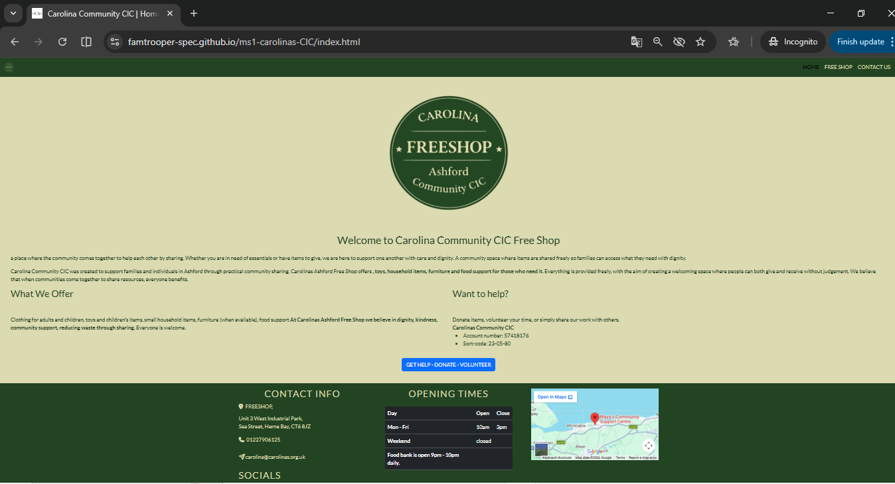
---

### 2. As a visitor  
I want to see what items are available in the Free Shop, so that I know whether it is worth visiting.

- **Feature:** Free Shop information page  
- **Acceptance Criteria:**  
  - Page lists typical items available  
  - Page lists items accepted and not accepted  
  - Page explains how the shop works  
- **Evidence:** Free Shop page explains what the shop is about.
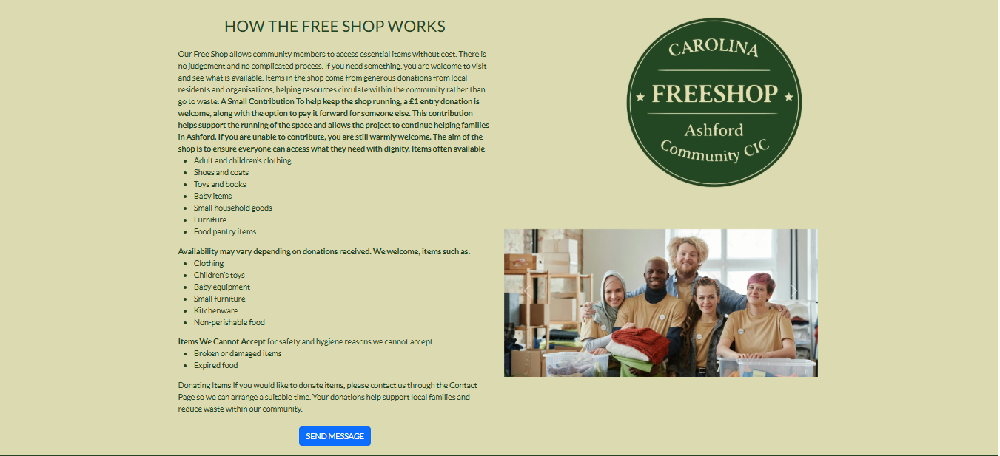

---

### 3. As a donor  
I want to know what items I can donate, so that I can give appropriate items.

- **Feature:** Donation guidance section  
- **Acceptance Criteria:**  
  - Clear list of acceptable items  
  - Clear list of items not accepted  
- **Evidence:** Free Shop page includes donation rules and contact link.
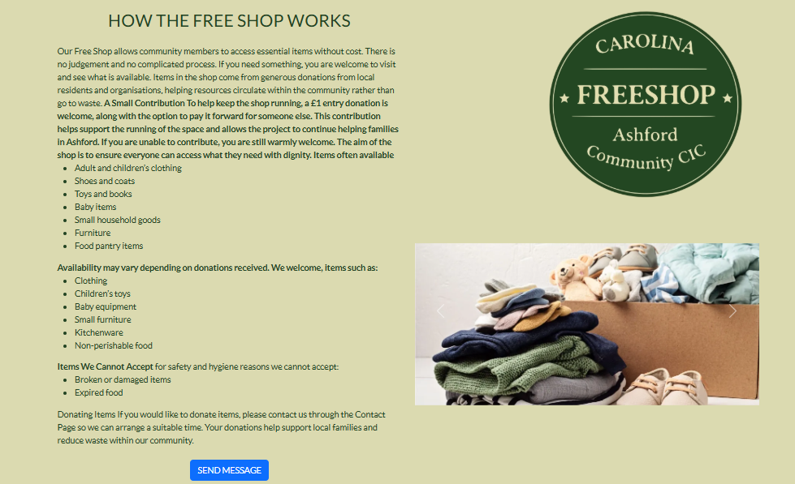
---

### 4. As a visitor  
I want to know the location and opening hours, so that I can plan my visit.

- **Feature:** Location & Opening Hours  
- **Acceptance Criteria:**  
  - Address is displayed  
  - Opening hours are displayed  
  - Page is mobile‑friendly  
- **Evidence:** footer includes address and hours.
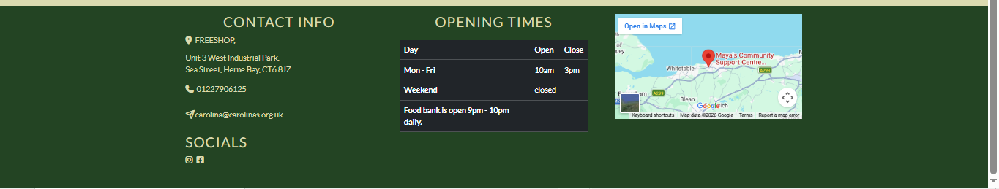

---

### 5. As a volunteer  
I want to understand how I can help, so that I can decide whether to get involved.

- **Feature:** Volunteer Information page  
- **Acceptance Criteria:**  
  - Page explains volunteer roles  
  - Page provides contact link  
  - Page is easy to navigate  
- **Evidence:**  
  These features are proposed future upgrades. They were not implemented because the CIC is not yet in full operation, and at this stage the clients were satisfied with a messaging sytem that people can ask questions about it.


---

### 6. As a user  
I want to send a message through a contact form, so that I can ask for help or make an enquiry.

- **Feature:** Contact form  
- **Acceptance Criteria:**  
  - Form includes name, email, message, and enquiry type  
  - Form cannot be submitted with empty required fields  
  - User sees a confirmation page after submitting  
- **Evidence:** Contact form and confirmation page implemented.
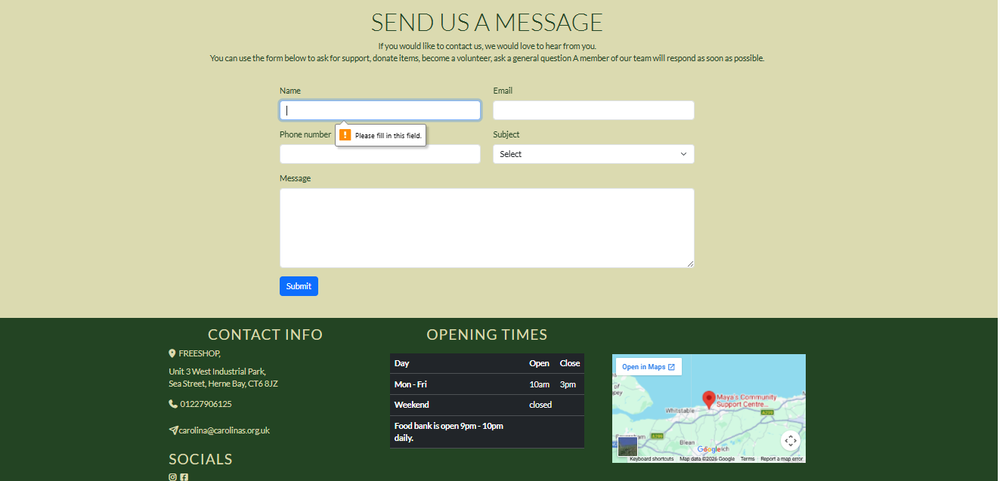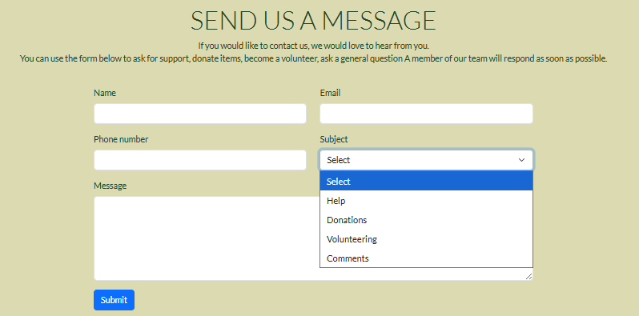
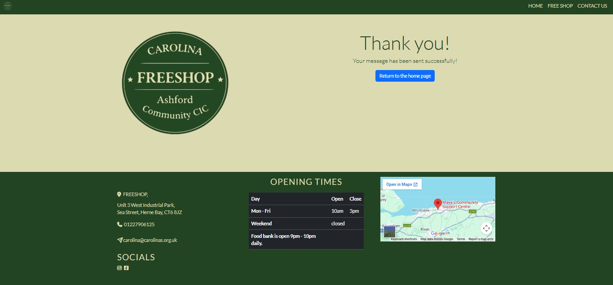
---

### 7. As a mobile user  
I want the site to be easy to read and navigate, so that I can access information quickly.

- **Feature:** Responsive design  
- **Acceptance Criteria:**  
  - Navbar collapses correctly  
  - Images scale without breaking layout  
  - No horizontal scrolling  
- **Evidence:** Responsive layout tested using Lighthouse and manual testing.
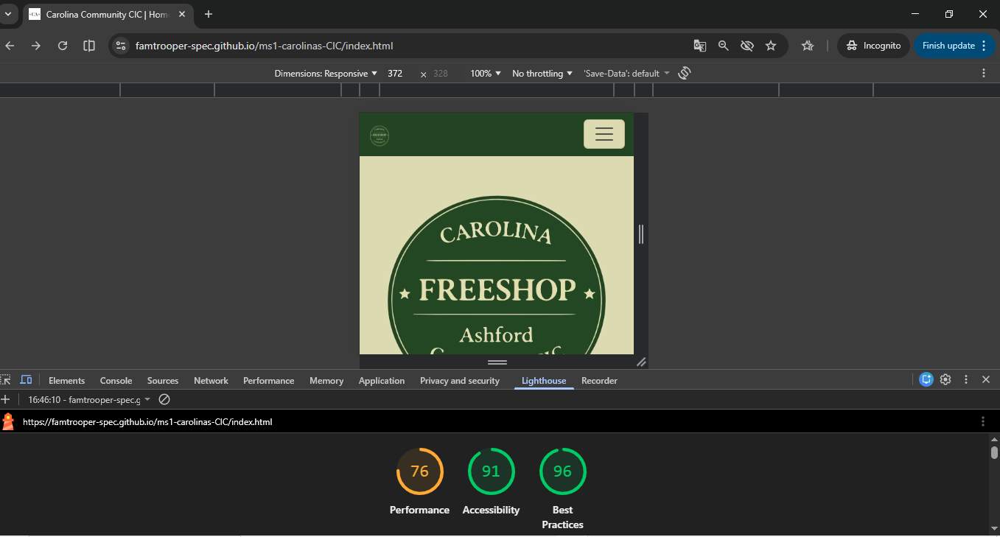
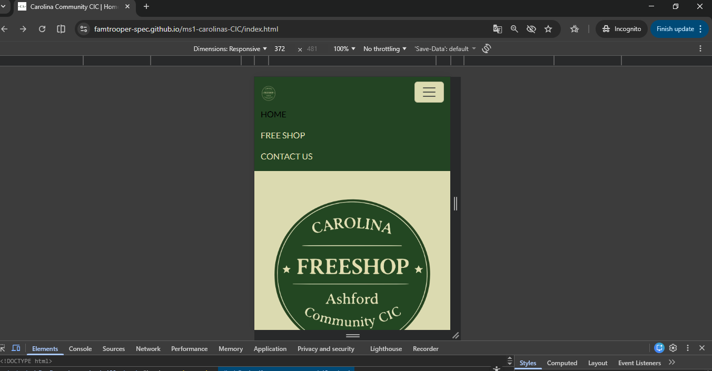
---

### 8. As a user with slow internet  
I want the site to load quickly, so that I can access information without delays.

- **Feature:** Image optimisation (WEBP)  
- **Acceptance Criteria:**  
  - Images load quickly  
- **Evidence:** Lighthouse scores documented in the testing section.
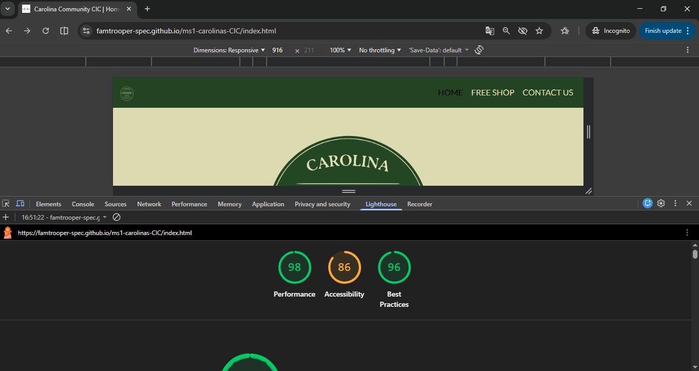

## User Story Traceability

| User Story ID | Feature Delivered | Evidence on Website |
|---------------|------------------|---------------------|
| US1 | Mission statement & homepage info | Home page (mission, opening hours, navigation) |
| US2 | Free Shop information | Free Shop page (how it works, items available, donation rules) |
| US3 | Donation guidance | Free Shop page (acceptable & non‑acceptable items, contact link) |
| US4 | Location & opening hours | Location & Hours page |
| US5 | Volunteer information | Volunteer page (roles, how to get involved) |
| US6 | Contact form | Contact Us page + confirmation page |
| US7 | Responsive layout | All pages (Bootstrap layout, fixed navbar collapse, no overflow) |
| US8 | Image optimisation | All pages (WEBP images, improved Lighthouse scores) |

---

## Project Status

The project is currently in a stable and usable state for the client.  
While the core features are complete, some items from the user stories such as a dedicated volunteer information page are planned for future development once the CIC becomes fully operational.

---

## Planned Features

- **Home Page** – Outlines the mission of the community CIC and displays the opening times of the free shop, with links to the contact page.  
- **Free Shop** – Provides clear information about how the shop works, what items are available, and what can be donated.  
- **Location & Opening Hours** – Shows where the service operates and when support is available.  
- **Contact Form** – Allows users to send messages or requests directly through the website, with a confirmation page after submission.

## Wireframes

Below are the wireframes created during the planning stage of the project.  
They include mobile, tablet, and desktop layouts to show responsive design planning.


---

### Home Page Wireframes

#### Mobile
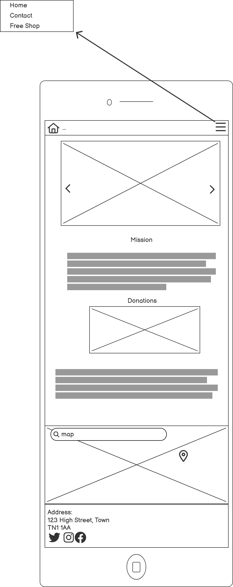

#### Tablet
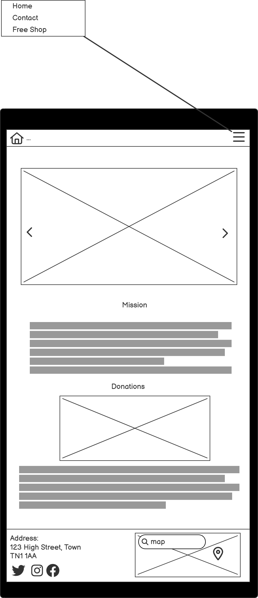

#### Desktop
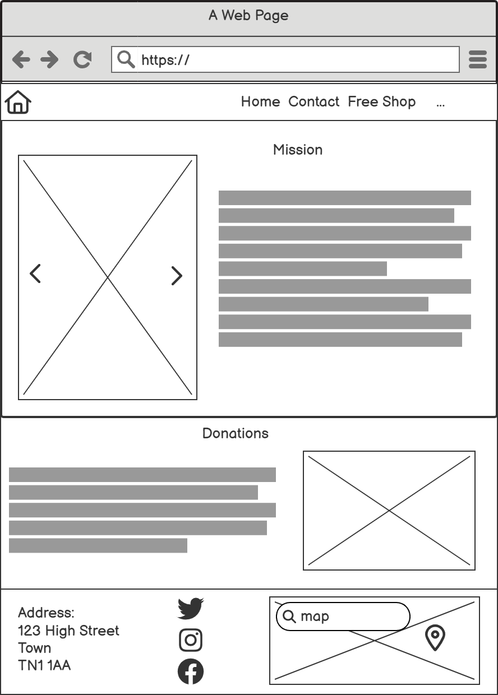

---

### Free Shop Page Wireframes

#### Mobile
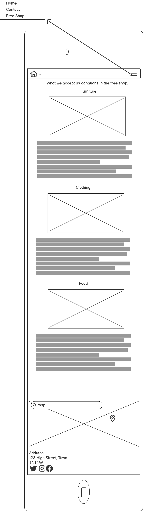

#### Tablet
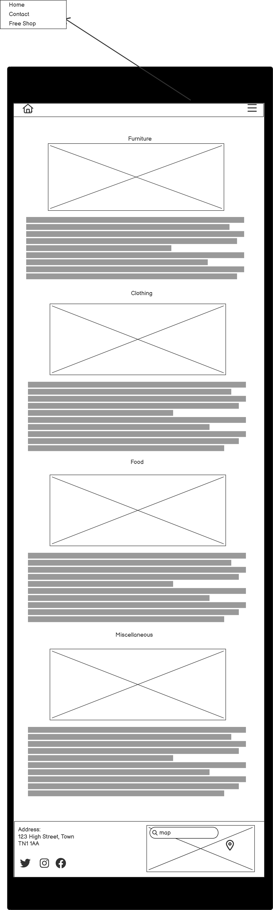

#### Desktop
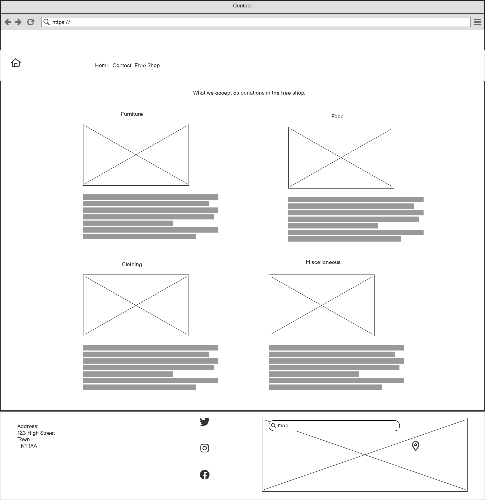

---

### Contact us Page Wireframes

#### Mobile
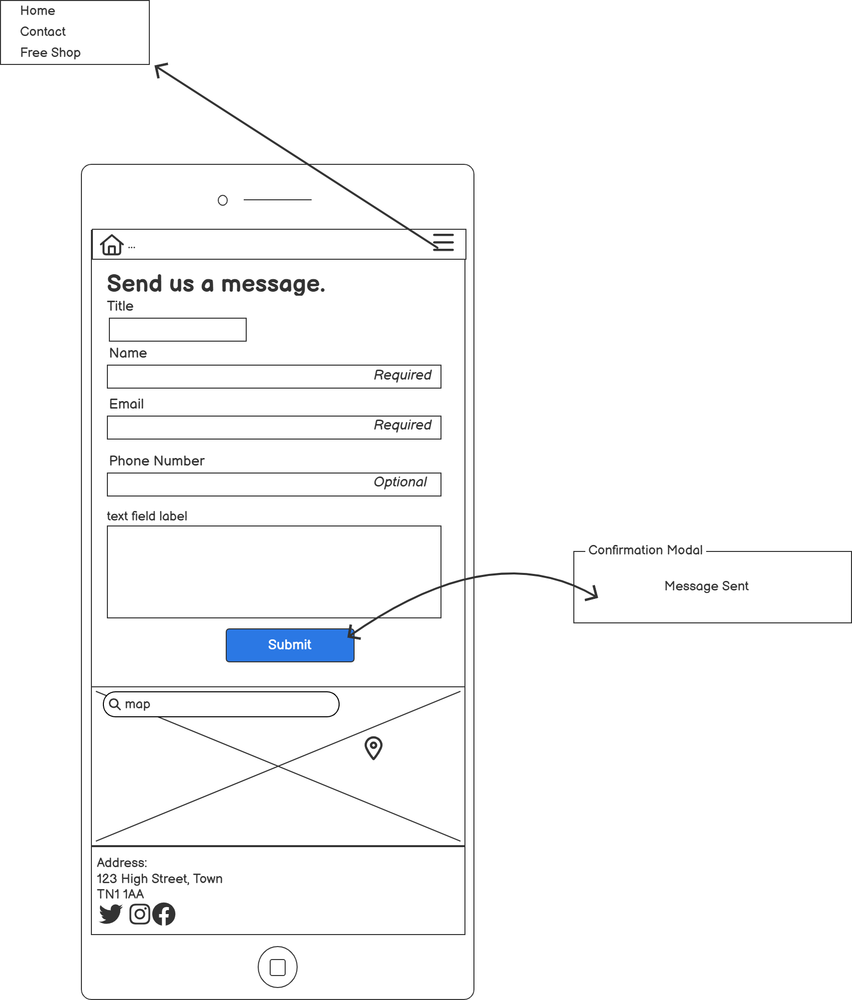

#### Tablet
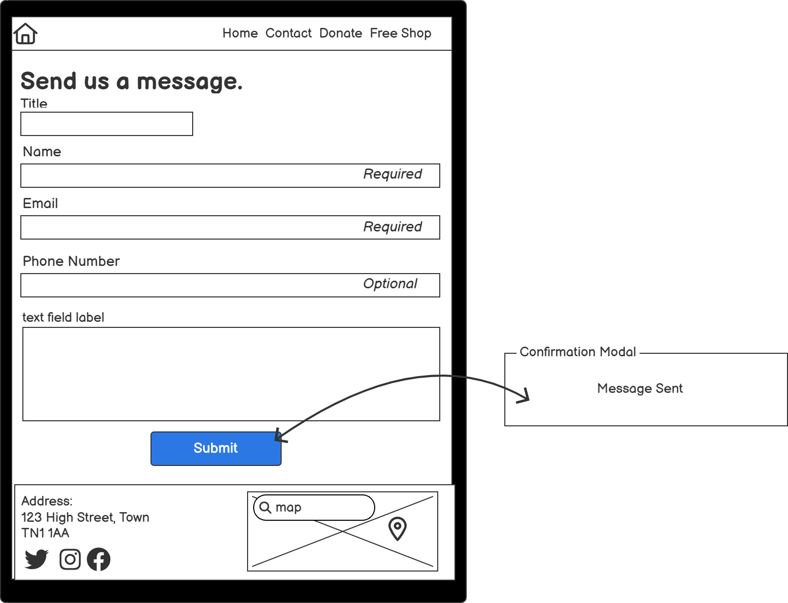

#### Desktop
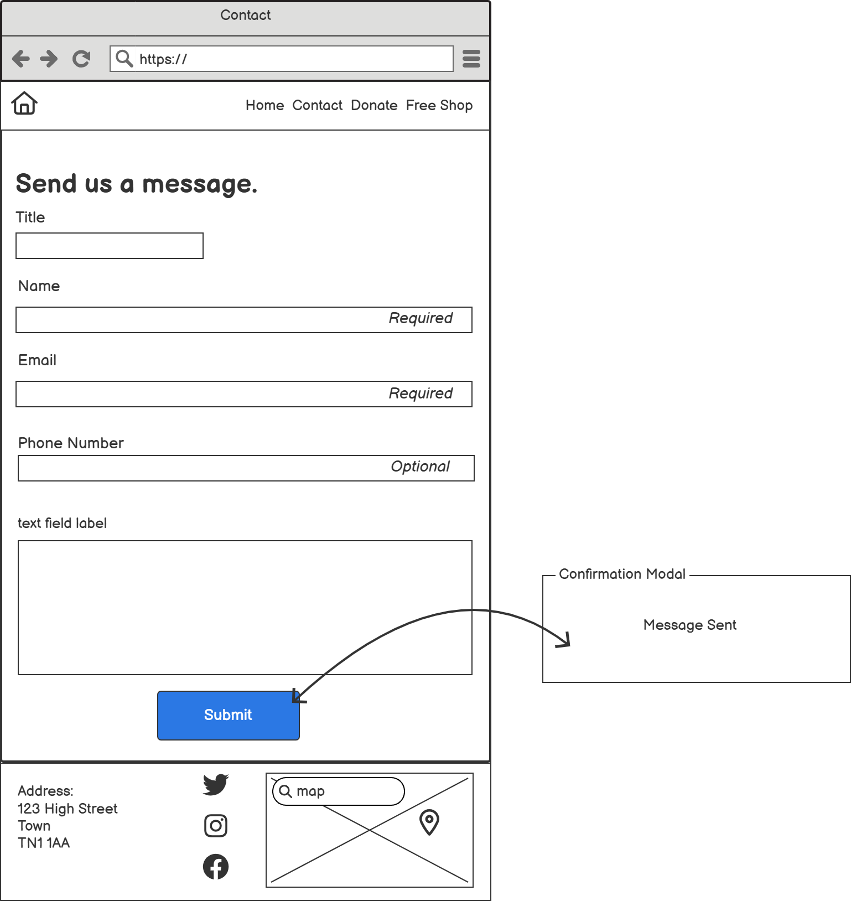
---

*You can also view the original Balsamiq project here:*  
[Wireframes (Balsamiq Link)](https://balsamiq.cloud/saz0gco/pjszc69)

## Visual Design & Accessibility
- **Colour palette** 
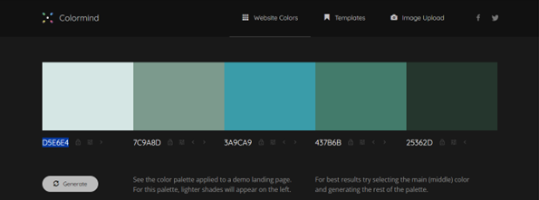

- **Typography choices**

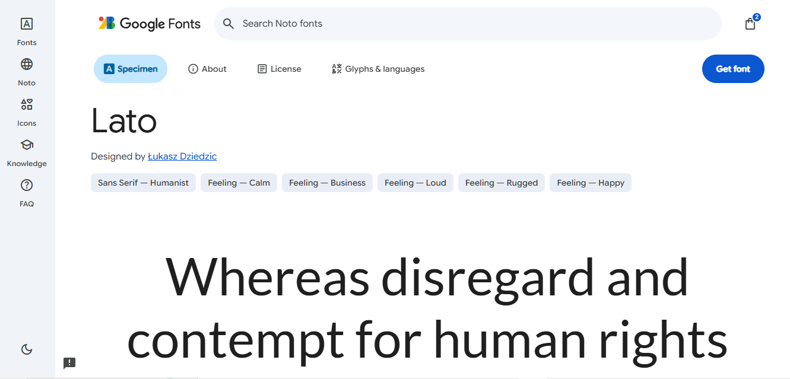

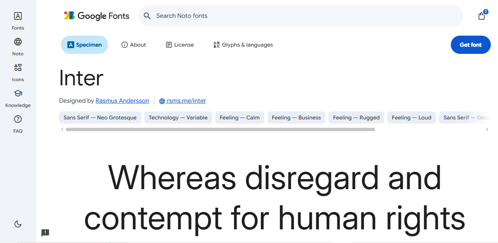

- **Explanation of decisions**
After consulting clients and after researching what most CIC's use on the web and their communications i found that they all use very professional looking fonts so I decided to stick with what already works for readability. I decided to use Inter as a primary font and Lato as a secondary font. 
The colour scheme was decided based on the CIC's logo which i uploaded onto the website colormind.io and it generated a colour palette which i then extracted 4 colours to use on the website, I then tested the background colour and the typography colour on the WebAim website and used its tool to test the contrast and it passed.
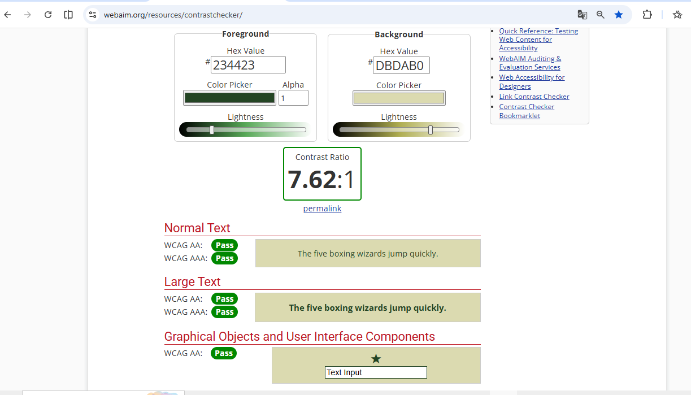

## Technology Stack

- **HTML5** – Provides the structure and semantic layout of the website.  
- **CSS3** – Handles styling, layout, and visual presentation.  
- **Bootstrap 5** – Offers responsive design components and a mobile‑first layout framework.  
- **Copilot (Study Mode)** – Assisted with debugging and improving layout issues.  
- **Pexels.com** – Source of some carousel images.  
- **Google Images** – Additional image sources for the carousel.  
- **Colormind.io** – Used to generate a colour palette based on the company logo.  
 - **WebAim** - I used this website to check the contrast of the two main colours would be good and make the website easier to read.
- **Font Awesome** – Provided icons such as the phone icon used next to the contact number.  
- **Google Fonts** – Used to import fonts that improve the look and feel of the website.  
- **Affinity App** – Used to resize, reformat, and adjust images and logos.
- **Favicon.io** - Used to make the tiny logos that go on top of the window of the browser.

---

## Installation & Setup
```
1. Clone the repository  
  
   git clone https://github.com/famtrooper-spec/ms1-carolinas-CIC.git
  
2. Navigate into the project folder

 - cd ms1-carolinas-CIC

3. Open the website locally
```bash
- Open `index.html` directly in your browser, or  
   - Use a tool such as *Live Server* in VS Code for automatic reloading.
```
## Usage

The website provides clear information about the organisation’s purpose, services, and location. Visitors can learn what support is available, check opening hours, and access contact details. The platform also includes a message form for enquiries and an option to choose what the message is about.

## Contributing
This project is not currently open for external contributions. As the website is part of a project for a course. Development will be carried out internally.

## Contact Information
For general enquiries or support requests, the organisation can be contacted through the official email address or via the contact form available on the website. All messages will be handled confidentially and responded to as promptly as possible.

## License
The licensing model for this project has not yet been determined. A suitable license will be added once the project is accepted by the clients.

## Testing
The website was tested throughout development to ensure functionality, responsiveness, accessibility, and performance. A combination of manual testing, Lighthouse audits, and W3C validation tools were used. Key findings and fixes are documented below.

**1. Manual Testing**

**Navbar collapsing too early on Chrome**

**Issue:**

 Navbar collapsed above 992px on Chrome but not on Edge.

**Cause:**
 
Horizontal overflow and a broken layout due to an extra closing. 

**Fix:**

Removed the extra closing tag.
Set carousel images to width: 100% and display: block.

Added overflow-x: hidden to html, body.
Changed Bootstrap class from navbar-expand-lg to navbar-expand-md for more stable behaviour.

 **Large image file sizes affecting performance**

**Issue:** Lighthouse flagged logo and images as too large. I reduced the images but decided againt logo as having previously tried the quality was reduced and logos were pixelated.

**Fix:** Converted all images from PNG/JPG to WEBP and reduced pixel dimensions using Affinity.

**Result:** Faster loading and improved Lighthouse performance scores.

**Empty space appearing on Chrome**

**Issue:** Large blank area below content.

**Cause:** Extra closing 
breaking the grid.

**Fix:** Removed the incorrect tag and retested.

## 2. Performance & Accessibility Testing (Lighthouse)
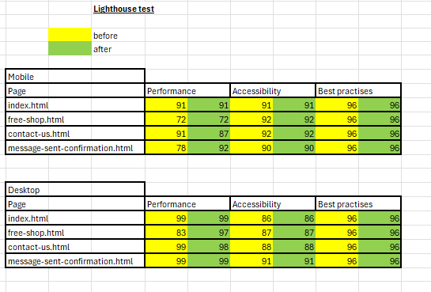

## 3. Validator Testing

•	**HTML Validator (W3C)**

Found several errors on the deployed site.
Corrected all issues and re validated until no errors remained.

•	**CSS Validator (W3C)**

No errors found.
Note: Validator warns that imported stylesheets cannot be checked, but this does not affect validation.

### Testing Summary

| Test Type | Tools Used | Outcome |
|----------|------------|---------|
| Performance | Lighthouse | slight improved scores on desktop after image optimisation |
| Responsiveness | Chrome, Edge, Mobile | Navbar and layout issues fixed |
| HTML Validation | W3C Validator | All errors resolved |
| CSS Validation | W3C Validator | No errors found |
| Manual Bug Testing | Browser inspection | Overflow, extra div, and image issues fixed |

**Following the completion of testing and bug fixes, the next steps for development are outlined in the Roadmap below.**

## Deployment to GitHub Pages
To publish the website, I used GitHub Pages, as it allows static sites to be hosted directly from a repository.

**Process Overview**

- I pushed all project files (HTML, CSS, images, screenshots, wireframes and assets) to an existing GitHub repository that i had made public for this project.
- Inside repository settings, I scrolled to the Pages section.
- Under Source, I selected the main branch and set the folder to /root (since my index.html is in the main directory).
- GitHub Pages automatically generated a live URL for the site.
- After a few seconds, the site became publicly accessible at:
https://famtrooper-spec.github.io/ms1-carolinas-CIC/ (famtrooper-spec.github.io in Bing)
- Whenever code is updated pushed as new commits, GitHub Pages automatically rebuilds and updates the live site.

**I chose Git Hub pages because**

- It integrates directly with version control
- It’s free and very reliable
- It automatically updates when changes are pushed and synced 
- It tends to work well for static front‑end projects like this one


## Roadmap
**Phase 1 – Planning & Design** 
  - Define site structure and content  
  - Create initial wireframes  
  - Confirm branding and visual style  

**Phase 2 – Development**  
  - Build core pages (Mission, Contact, Location & Hours)  
  - Implement responsive layout using Bootstrap  
  - Add contact form functionality  

**Phase 3 – Testing & Review**
  - Test accessibility and mobile responsiveness  
  - Review content accuracy and clarity  
  - Gather internal feedback  

**Phase 4 – Launch**  
  - Deploy website via GitHub Pages  
  - Publish final content  
  - Begin community outreach  

**Future Enhancements**   
  - Volunteer sign‑up form  
  - Multilingual support  
  - Photo gallery of community work 


**Acknowledgements**

This project is inspired by the ongoing work of community organisations that are dedicated to supporting families and individuals in need. Appreciation is extended to all volunteers, partners, and supporters whose commitment makes this initiative possible. Additional thanks to similar community projects, such as mayas.org.uk, for providing valuable inspiration and guidance during the planning phase.


 


